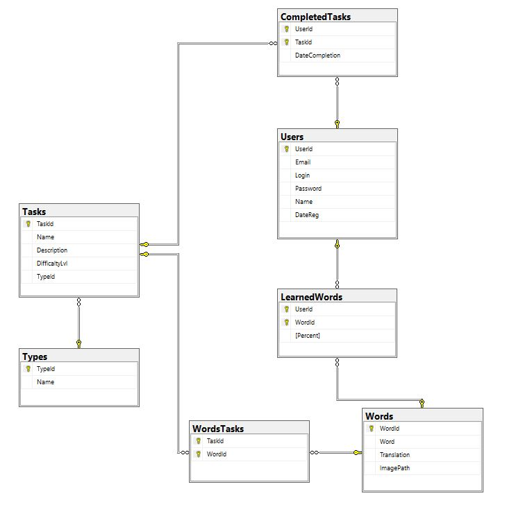

# TestWebAPI
Проект Web API, реализованный средствами ASP.NET Core, EntityFramework
## Описание предметной области
+ В онлайн-сервисе обучения иностранному языку пользователи изучают иностранные слова путём выполнения различных заданий.
+ У каждого пользователя есть адрес электронной почты, логин пароль, имя и дата регистрации (задаётся автоматически при добавлении пользователя).
+ Каждое задание в сервисе характеризуется названием, описанием, типом (строка, enum или отдельная таблица, на выбор) и уровнем сложности (дробное число). 
+ Каждый пользователь может выполнять множество заданий, задания могут выполняться множеством пользователей. О факте прохождения каждого задания также сохраняется дата.
+ В каждое задание входит множество слов, а каждое слово может входить во множество заданий.
+ Каждое слово характеризуется текстом на иностранном языке, переводом на текущем языке и путём до изображения, характеризующего его.
+ Пользователь может изучить множество слов, а каждое слово может быть изучено множеством пользователей. Причём каждое слово пользователь может изучить на определённый процент (число, от 0 до 100) после выполнения заданий.

### Ef-диаграмма
На основе описания предметной области была спроектирована ef-диаграмма:


## База данных
В проекте были созданы модели сущностей БД, произведены миграции в SQL Server Management Studio. Выполнено наполнение БД тестовыми псевдо-реалистичными данными путём их импорта из файлов CSV посредством запросов SQl.
### Модели сущностей БД
Модель сущности Users:
```cs
public class Users
{
    [Key]
    public int UserId { get; set; }
    public string Email { get; set; }
    public string Login { get; set; }
    public string Password { get; set; }
    public string Name { get; set; }
    public DateTime DateReg { get; set; }
        
    public virtual ICollection<CompletedTasks> CompletedTasks { get; set; }
    public virtual ICollection<LearnedWords> LearnedWords { get; set; }
}
```
Модель сущности Tasks:
```C#
public class Tasks
{
    [Key]
    public int TaskId { get; set; }
    public string Name { get; set; }
    public string Description { get; set; }
    public double DifficaltyLvl { get; set; }
    [ForeignKey(nameof(Types))]
    public int TypeId { get; set; }
        
    public virtual Types Types { get; set; }
    public virtual ICollection<CompletedTasks> CompletedTasks { get; set; }
    public virtual ICollection<WordsTasks> WordsTasks { get; set; }
}
```
Модель сущности Types:
```C#
public class Types
{
    [Key]
    public int TypeId { get; set; }
    public string Name { get; set; }
        
    public virtual ICollection<Tasks> Tasks { get; set; }
}
```
Модель сущности Words:
```C#
public class Words
{
    [Key]
    public int WordId { get; set; }
    public string Word { get; set; }
    public string Translation { get; set; }
    public string ImagePath { get; set; }
        
    public virtual ICollection<WordsTasks> WordsTasks { get; set; }
    public virtual ICollection<LearnedWords> LearnedWords { get; set; }
}
```
Модель сущности WordsTasks:
```C#
public class WordsTasks
{
    [ForeignKey(nameof(Tasks))]
    public int TaskId { get; set; }
        
    [ForeignKey(nameof(Words))]
    public int WordId { get; set; }

    public virtual Tasks Tasks { get; set; }
    public virtual Words Words { get; set; }
}
```
Модель сущности LearnedWords:
```C#
public class LearnedWords
{
    [ForeignKey(nameof(Users))]
    public int UserId { get; set; }
        
    [ForeignKey(nameof(Words))]
    public int WordId { get; set; }
        
    public int Percent { get; set; }

    public virtual Users Users { get; set; }
    public virtual Words Words { get; set; }
}
```
Модель сущности CompletedTasks:
```C#
public class CompletedTasks
{
    [ForeignKey(nameof(Users))]
    public int UserId { get; set; }
        
    [ForeignKey(nameof(Tasks))]
    public int TaskId { get; set; }
        
    public DateTime DateCompletion { get; set; }
        
    public virtual Users Users { get; set; }
    public virtual Tasks Tasks { get; set; }
}
```

### Миграции
В проекте было реализовано несколько миграций посредством операций dotnet ef, их можно посмотреть в файлах папки Migrations. 
В ходе миграций была создана локальная БД DbTestWebAPI со структурой:


Диаграмма БД в системе SQL Server Management Studio:



### Код таблиц БД
Код таблицы Users:
```SQL
CREATE TABLE [dbo].[Users](
	[UserId] [int] IDENTITY(1,1) NOT NULL,
	[Email] [nvarchar](max) NULL,
	[Login] [nvarchar](max) NULL,
	[Password] [nvarchar](max) NULL,
	[Name] [nvarchar](max) NULL,
	[DateReg] [datetime2](7) NOT NULL,
 CONSTRAINT [PK_Users] PRIMARY KEY CLUSTERED 
(
	[UserId] ASC
)WITH (PAD_INDEX = OFF, STATISTICS_NORECOMPUTE = OFF, IGNORE_DUP_KEY = OFF, ALLOW_ROW_LOCKS = ON, ALLOW_PAGE_LOCKS = ON, OPTIMIZE_FOR_SEQUENTIAL_KEY = OFF) ON [PRIMARY]
) ON [PRIMARY] TEXTIMAGE_ON [PRIMARY]
```

Код таблицы Tasks:
```SQL
CREATE TABLE [dbo].[Tasks](
	[TaskId] [int] IDENTITY(1,1) NOT NULL,
	[Name] [nvarchar](max) NULL,
	[Description] [nvarchar](max) NULL,
	[DifficaltyLvl] [float] NOT NULL,
	[TypeId] [int] NOT NULL,
 CONSTRAINT [PK_Tasks] PRIMARY KEY CLUSTERED 
(
	[TaskId] ASC
)WITH (PAD_INDEX = OFF, STATISTICS_NORECOMPUTE = OFF, IGNORE_DUP_KEY = OFF, ALLOW_ROW_LOCKS = ON, ALLOW_PAGE_LOCKS = ON, OPTIMIZE_FOR_SEQUENTIAL_KEY = OFF) ON [PRIMARY]
) ON [PRIMARY] TEXTIMAGE_ON [PRIMARY]
GO

ALTER TABLE [dbo].[Tasks]  WITH NOCHECK ADD  CONSTRAINT [FK_Tasks_Types_TypeId] FOREIGN KEY([TypeId])
REFERENCES [dbo].[Types] ([TypeId])
ON DELETE CASCADE
GO

ALTER TABLE [dbo].[Tasks] CHECK CONSTRAINT [FK_Tasks_Types_TypeId]
GO
```

Код таблицы Types:
```SQL
CREATE TABLE [dbo].[Types](
	[TypeId] [int] IDENTITY(1,1) NOT NULL,
	[Name] [nvarchar](max) NULL,
 CONSTRAINT [PK_Types] PRIMARY KEY CLUSTERED 
(
	[TypeId] ASC
)WITH (PAD_INDEX = OFF, STATISTICS_NORECOMPUTE = OFF, IGNORE_DUP_KEY = OFF, ALLOW_ROW_LOCKS = ON, ALLOW_PAGE_LOCKS = ON, OPTIMIZE_FOR_SEQUENTIAL_KEY = OFF) ON [PRIMARY]
) ON [PRIMARY] TEXTIMAGE_ON [PRIMARY]
GO

```

Код таблицы Words:
```SQL
CREATE TABLE [dbo].[Words](
	[WordId] [int] IDENTITY(1,1) NOT NULL,
	[Word] [nvarchar](max) NULL,
	[Translation] [nvarchar](max) NULL,
	[ImagePath] [nvarchar](max) NULL,
 CONSTRAINT [PK_Words] PRIMARY KEY CLUSTERED 
(
	[WordId] ASC
)WITH (PAD_INDEX = OFF, STATISTICS_NORECOMPUTE = OFF, IGNORE_DUP_KEY = OFF, ALLOW_ROW_LOCKS = ON, ALLOW_PAGE_LOCKS = ON, OPTIMIZE_FOR_SEQUENTIAL_KEY = OFF) ON [PRIMARY]
) ON [PRIMARY] TEXTIMAGE_ON [PRIMARY]
GO
```

Код таблицы WordsTasks:
```SQL
CREATE TABLE [dbo].[WordsTasks](
	[TaskId] [int] NOT NULL,
	[WordId] [int] NOT NULL,
 CONSTRAINT [PK_WordsTasks] PRIMARY KEY CLUSTERED 
(
	[TaskId] ASC,
	[WordId] ASC
)WITH (PAD_INDEX = OFF, STATISTICS_NORECOMPUTE = OFF, IGNORE_DUP_KEY = OFF, ALLOW_ROW_LOCKS = ON, ALLOW_PAGE_LOCKS = ON, OPTIMIZE_FOR_SEQUENTIAL_KEY = OFF) ON [PRIMARY]
) ON [PRIMARY]
GO

ALTER TABLE [dbo].[WordsTasks]  WITH NOCHECK ADD  CONSTRAINT [FK_WordsTasks_Tasks_TaskId] FOREIGN KEY([TaskId])
REFERENCES [dbo].[Tasks] ([TaskId])
ON DELETE CASCADE
GO

ALTER TABLE [dbo].[WordsTasks] CHECK CONSTRAINT [FK_WordsTasks_Tasks_TaskId]
GO

ALTER TABLE [dbo].[WordsTasks]  WITH NOCHECK ADD  CONSTRAINT [FK_WordsTasks_Words_WordId] FOREIGN KEY([WordId])
REFERENCES [dbo].[Words] ([WordId])
ON DELETE CASCADE
GO

ALTER TABLE [dbo].[WordsTasks] CHECK CONSTRAINT [FK_WordsTasks_Words_WordId]
GO
```

Код таблицы CompletedTasks:
```SQL
CREATE TABLE [dbo].[CompletedTasks](
	[UserId] [int] NOT NULL,
	[TaskId] [int] NOT NULL,
	[DateCompletion] [datetime2](7) NOT NULL,
 CONSTRAINT [PK_CompletedTasks] PRIMARY KEY CLUSTERED 
(
	[UserId] ASC,
	[TaskId] ASC
)WITH (PAD_INDEX = OFF, STATISTICS_NORECOMPUTE = OFF, IGNORE_DUP_KEY = OFF, ALLOW_ROW_LOCKS = ON, ALLOW_PAGE_LOCKS = ON, OPTIMIZE_FOR_SEQUENTIAL_KEY = OFF) ON [PRIMARY]
) ON [PRIMARY]
GO

ALTER TABLE [dbo].[CompletedTasks]  WITH NOCHECK ADD  CONSTRAINT [FK_CompletedTasks_Tasks_TaskId] FOREIGN KEY([TaskId])
REFERENCES [dbo].[Tasks] ([TaskId])
ON DELETE CASCADE
GO

ALTER TABLE [dbo].[CompletedTasks] CHECK CONSTRAINT [FK_CompletedTasks_Tasks_TaskId]
GO

ALTER TABLE [dbo].[CompletedTasks]  WITH NOCHECK ADD  CONSTRAINT [FK_CompletedTasks_Users_UserId] FOREIGN KEY([UserId])
REFERENCES [dbo].[Users] ([UserId])
ON DELETE CASCADE
GO

ALTER TABLE [dbo].[CompletedTasks] CHECK CONSTRAINT [FK_CompletedTasks_Users_UserId]
GO
```

Код таблицы LearnedWords:
```SQL
CREATE TABLE [dbo].[LearnedWords](
	[UserId] [int] NOT NULL,
	[WordId] [int] NOT NULL,
	[Percent] [int] NOT NULL,
 CONSTRAINT [PK_LearnedWords] PRIMARY KEY CLUSTERED 
(
	[UserId] ASC,
	[WordId] ASC
)WITH (PAD_INDEX = OFF, STATISTICS_NORECOMPUTE = OFF, IGNORE_DUP_KEY = OFF, ALLOW_ROW_LOCKS = ON, ALLOW_PAGE_LOCKS = ON, OPTIMIZE_FOR_SEQUENTIAL_KEY = OFF) ON [PRIMARY]
) ON [PRIMARY]
GO

ALTER TABLE [dbo].[LearnedWords]  WITH NOCHECK ADD  CONSTRAINT [FK_LearnedWords_Users_UserId] FOREIGN KEY([UserId])
REFERENCES [dbo].[Users] ([UserId])
ON DELETE CASCADE
GO

ALTER TABLE [dbo].[LearnedWords] CHECK CONSTRAINT [FK_LearnedWords_Users_UserId]
GO

ALTER TABLE [dbo].[LearnedWords]  WITH NOCHECK ADD  CONSTRAINT [FK_LearnedWords_Words_WordId] FOREIGN KEY([WordId])
REFERENCES [dbo].[Words] ([WordId])
ON DELETE CASCADE
GO

ALTER TABLE [dbo].[LearnedWords] CHECK CONSTRAINT [FK_LearnedWords_Words_WordId]
GO
```

### Заполнение БД
Для наполнения БД были сгенерированы файлы CSV с тестовыми данными (находятся в папке [CSV](.TestWebAPI/Files/CSV/Users.csv)). Для всех сущностей помимо Types были созданы 1010 записей, для Types 10 записей. В SQL Server Management Studio для каждого файла были выполнены SQL скрипты, общий вид которых сводится к:

```SQL
BULK INSERT [DbTestWebAPI].[dbo].[TableName]
FROM '...\TestWebAPI\TestWebAPI\Files\CSV\FileName.csv'
WITH (FIRSTROW = 2,FIELDTERMINATOR = ',', ROWTERMINATOR = '\n');
```
Все SQL скрипты можно найти в папке [SQL](.TestWebAPI/Files/SQL/UsersSQL.txt) проекта.


## Запросы Swagger
В рамках реализации Swagger были выполнены CRUD-запросы к двум таблицам БД, а также запросы относящиеся к предметной области.

### CRUD-запросы
Для сущностей Users и Tasks были созданы стандартные CRUD запросы.

Запросы для Users:


Запросы для Tasks:


Пример выполнения запроса Get для взятия всех Tasks:


Пример выполнения запроса Get для взятия User по его userId:


### Запросы предметной области
Помимо CRUD-запросов к двум таблицам были реализованы запросы и методы предметной области:
+ Вывести все задания заданного типа, выполненные заданным пользователем за последнюю неделю, уровень сложности которых от X до Y, например, от 3 до 5, а название начинается со слова, например, "Повторение ...".
+ Вывести все слова, которые выучил заданный пользователь и на какой процент.
+ Вывести ТОП N пользователей, отсортированных по количеству изученных слов на процент, больше ХХ%, где N - целое число (т.е. вывести ТОП 5 или ТОП 3 пользователя и т.п.)
+ Вывести все задания, в которые входит заданное слово и статус, выполнено ли это задание заданным пользователем.

Их вид в Swagger:


#### Код запросов на LINQ
Полный код методов можно посмотреть в файле [OtherRepository](./TestWebAPI/Repositories/Other/OtherRepository.cs)

+ Вывести все слова, которые выучил заданный пользователь и на какой процент:
```C#
var res =  await Context.LearnedWords.Where(q => q.UserId == UserId).Select(q => new WordWithPercentDto {Word = q.Words.Word, Percent = q.Percent}).ToArrayAsync();
```
+ Вывести все задания заданного типа, выполненные заданным пользователем за последнюю неделю, уровень сложности которых от X до Y, например, от 3 до 5, а название начинается со слова, например, "Повторение ...":
```C#
var dateToday = DateTime.Today;
var dayOfWeek = (int)dateToday.DayOfWeek;
var dateMonday = dateToday.AddDays(1-dayOfWeek);

var res = await Context.CompletedTasks
	// возьмем выполненные задачи (ComponentTasks) по пользователю (UserId) и типу (TypeId) 
	.Where(q => q.UserId == user.UserId && q.Tasks.TypeId == type.TypeId)
	// далее извлечем задачи, удовлетворяющие условию: DifLvlMin < DifficaltyLvl < DifLvlMax
	.Where(q => q.Tasks.DifficaltyLvl > filters.DifLvlMin && q.Tasks.DifficaltyLvl < filters.DifLvlMax)
	// выполненные втечение текущей недели
	.Where(q=>DateTime.Compare(q.DateCompletion, dateMonday) >= 0 && DateTime.Compare(q.DateCompletion, dateToday)<=0)
	// задачи, имя которых начинается с указанного в фильтрах значения StartWithStr
	.Where(q=>q.Tasks.Name.StartsWith(filters.StartWithStr))
	// преобразем к нужной модели данных
	.Select(q=>new TaskByUserAndTypeDto{Name = q.Tasks.Name, Description = q.Tasks.Description, DifficaltyLvl = q.Tasks.DifficaltyLvl})
	.ToArrayAsync();
```
+ Вывести все задания, в которые входит заданное слово и статус, выполнено ли это задание заданным пользователем:
```C#
var res = await Context.CompletedTasks
	.Where(q => q.UserId == filters.UserId && q.Tasks.Description.Contains(filters.Word))
	.Select(q=>
        	new TaskDto
                {
                	TaskId = q.TaskId,
                        Name = q.Tasks.Name,
                        Description = q.Tasks.Description,
                        DifficaltyLvl = q.Tasks.DifficaltyLvl,
                        TypeId = q.Tasks.TypeId
		})
	.ToArrayAsync();
```
+ Вывести ТОП N пользователей, отсортированных по количеству изученных слов на процент, больше ХХ%, где N - целое число (т.е. вывести ТОП 5 или ТОП 3 пользователя и т.п.):
```C#
var res= await Context.LearnedWords
	// возьмем изученные слова с процентом изученности больше заданного
	.Where(q => q.Percent > filters.Percent)
	// преобразуем в новый тип - извлечем кол-во изученных каждым пользователем слов и самих пользователей
	.Select(q => new {user = q.Users, count = q.Users.LearnedWords.Count})
	// оставим только уникальных пользователей
	.Distinct()
	// отсортируем по убыванию на основе кол-ва изученных слов
	.OrderByDescending(q=>q.count)
	// извлечем пользователей
	.Select(q=>q.user)
	// возмем n-е кол-во первых пользователей
	.Take(filters.TopNum)
	.ToArrayAsync();
```


